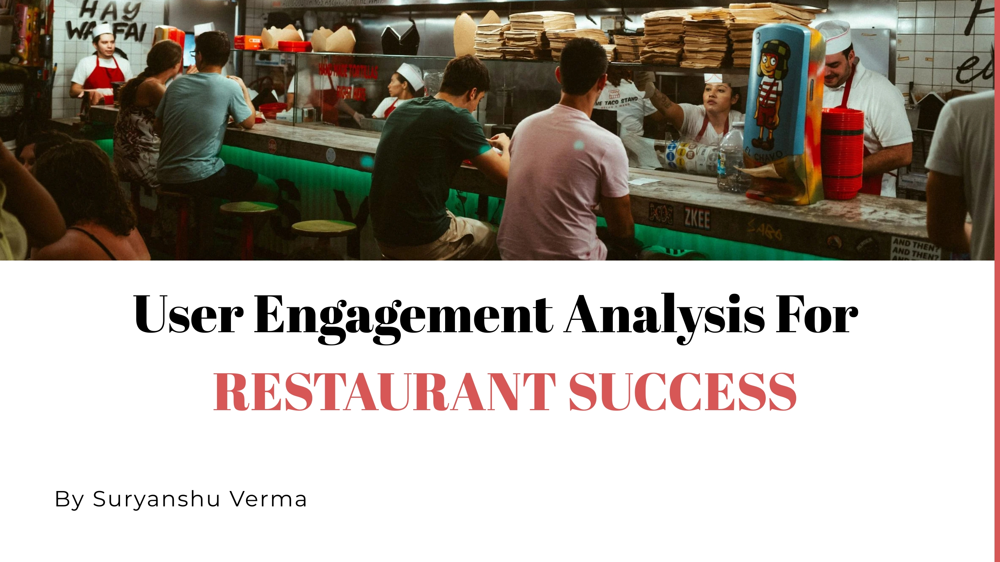

# Restaurant Success Analysis

## Project Overview
In the highly competitive restaurant industry, understanding the impact of user engagement on business success is critical. This project aims to identify and quantify correlations between user engagement metrics—such as reviews, tips, and check-ins—and business performance indicators, including review counts and average ratings. By analyzing the Yelp dataset, this project provides data-driven insights that can guide strategic decision-making to enhance restaurant performance and foster sustainable growth.

## Problem Statement
Stakeholders in the restaurant industry often lack clear insights into which user engagement factors most strongly influence business success. This project addresses this issue by answering the question: **How do user engagement metrics influence business performance indicators for restaurants?** Understanding these relationships can help stakeholders make informed decisions to improve engagement strategies and optimize business outcomes.

## Research Objectives
1. **Quantify the Correlation Between User Engagement and Business Metrics**  
   Assess the relationships between user engagement metrics (reviews, tips, check-ins) and business metrics (review count, average rating). Determine if higher engagement correlates with improved ratings and increased reviews.

2. **Analyze the Impact of Sentiment on Business Performance**  
   Investigate whether positive sentiment in user reviews and tips correlates with higher ratings and more frequent reviews, highlighting the influence of sentiment on success.

3. **Identify Time Trends in User Engagement**  
   Explore if consistent engagement over time indicates long-term success better than sporadic activity, offering insights into engagement patterns linked to sustained growth.

4. **Adapt Research Based on Emerging Insights**  
   Continuously refine the research focus based on initial findings, adjusting objectives as new insights are uncovered.

## Dataset
The project utilizes the **Yelp Dataset**, which provides comprehensive information on restaurant reviews, tips, check-ins, and business attributes. This dataset is well-suited for understanding how various user engagement factors relate to business performance in the restaurant industry.

## Methodology
1. **Data Preprocessing**  
   Clean and transform the data to ensure accuracy in analysis, including handling missing values and normalizing text for sentiment analysis.

2. **Exploratory Data Analysis (EDA)**  
   Visualize and analyze patterns and trends in user engagement metrics and business performance indicators.

3. **Sentiment Analysis**  
   Apply natural language processing techniques to extract sentiment from reviews and tips, exploring correlations with ratings and review counts.

4. **Time Series Analysis**  
   Analyze user engagement over time to detect patterns of sustained or sporadic activity and evaluate how these trends relate to business performance.

5. **Statistical Analysis**  
   Use correlation analysis, hypothesis testing, and regression modeling to assess the strength and significance of relationships between engagement and performance metrics.

## Results and Insights
Key findings from this analysis will provide actionable insights into:
- The types of engagement that most strongly influence restaurant success.
- The role of positive sentiment in achieving higher ratings and more reviews.
- Time-based patterns in engagement that contribute to long-term growth.
- To review the recommendations and insights, please refer to the presentation located in the "PPT" folder in the repository.

## Tools and Libraries
- **Python**: Pandas, NumPy, Matplotlib, Seaborn, Scikit-Learn
- **Natural Language Processing**: NLTK, TextBlob
- **Database**: SQL or NoSQL database for structured data storage
- **Visualization**: Matplotlib, Seaborn for insights and trend visualization

## How to Run the Project
1. Clone this repository:
   ```bash
   git clone https://github.com/Suryanshu-Verma/Restaurant-Success-Analysis.git
   ```
## Future Work 
1. **Predictive Modeling**
    Develop models to predict business performance based on user engagement patterns.
2. **Enhanced Sentiment Analysis**
   Explore more complex NLP models to improve sentiment accuracy and analysis depth.
3. **Geographical Analysis**
   Examine engagement trends across different locations to identify region-specific factors.
## Contributing
  Contributions to this project are welcome! Please submit a pull request or reach out to discuss potential contributions or improvements.
## License
  This project is licensed under the MIT License 
## Contact
  For questions or further information, please contact : suryanshuverma30@gmail.com
  
  

